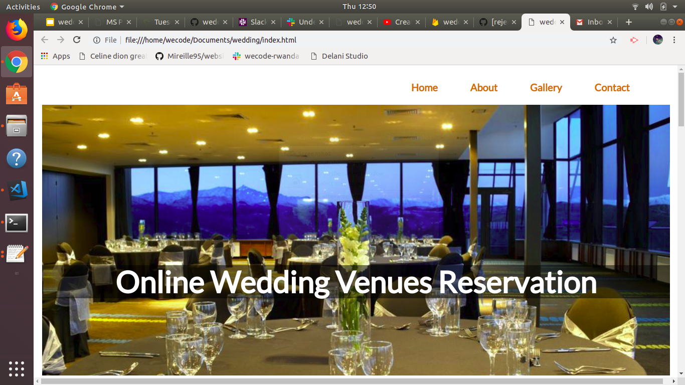

## Project name
Online Wedding Venues Reservation

## Project description
WeedingHalls project is an online wedding halls reservation  where you can see a wedding hall in our gallery and then you book the one you prefer.
<a href="#">webpage</a>
## Authors
* NIYOMUFASHA Emerance
* UMUHIRE  Anuarithe
* UMUTONIWASE Mireille
* USANASE Francoise

### setup installations
- You see halls in the gallery
- Then you book
- The system gives feedback to the clients

### Technologies used
|    Name                        |          Role                                |
|--------------------------------|----------------------------------------------|
| jQuery                         | Creating functions and giving feedback       |
| Bootstrap                      | Designing for betterLook                     |
| Firebase                       | Database                                     |
| Html                           | for designing the page                       |
| Css                            | for styling the pages                        |
| JavaScript                     | for coding                                   |

### MVP
Name: Online Wedding Halls
Features:
+ User browser over our pages
+ user be able to book 
+ user be able to leave a comment
+ user be able to see the checkout

### Technologies used
+ html
+ css 
+ javascripts
+ github
+ bootstraps
+ jquery

### copyright and lisence
